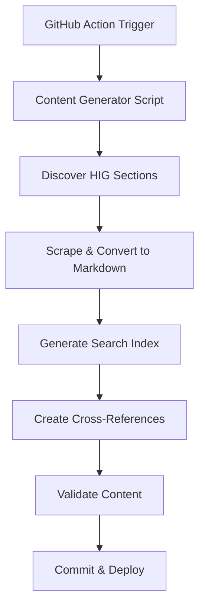

# Static Content Generation Guide

This document explains the static content generation system that powers the hybrid architecture of the Apple HIG MCP Server.

## Overview

The static content generation system creates optimized markdown files and search indices from Apple's Human Interface Guidelines, providing instant responses without scraping delays.

## Architecture

### Hybrid System Benefits

| Feature | Static Content | Live Scraping |
|---------|----------------|---------------|
| **Response Time** | < 50ms | 1-10 seconds |
| **Reliability** | 99.9% uptime | ~95% (depends on Apple) |
| **Concurrent Users** | Unlimited | 30 req/min limit |
| **Apple Dependency** | None at runtime | Real-time |

### Generation Workflow



## Generated Content Structure

```
content/
├── platforms/           # Platform-specific guidelines
│   ├── ios/
│   │   ├── buttons.md
│   │   ├── navigation.md
│   │   └── typography.md
│   ├── macos/
│   ├── watchos/
│   ├── tvos/
│   └── visionos/
├── metadata/           # Search optimization
│   ├── search-index.json      # Pre-built search indices
│   ├── cross-references.json  # Related content links
│   └── generation-info.json   # Content metadata
└── images/            # Visual assets (future)
```

## Manual Content Generation

### Prerequisites

- Node.js 18+ with npm
- Git repository access
- Network access to Apple's HIG website

### Running Generation

```bash
# Generate all static content
npm run generate-content

# Validate generated content
npm run validate-content

# Test with health check
npm run health-check
```

### Generation Script Options

The content generator (`scripts/generate-hig-content.ts`) supports various configuration options:

```typescript
// Environment variables
CONTENT_OUTPUT_DIR=./content     # Output directory
HIG_BASE_URL=https://developer.apple.com/design/human-interface-guidelines/
GENERATION_TIMEOUT=300000        # 5 minutes
BATCH_SIZE=10                    # Concurrent requests
```

## Content Format

### Markdown Files

Each generated file follows this structure:

```markdown
---
title: "iOS Buttons"
platform: "iOS"
category: "visual-design"
url: "https://developer.apple.com/design/human-interface-guidelines/ios/controls/buttons/"
id: "ios-buttons-12345"
lastUpdated: "2025-06-25T10:30:00Z"
---

# iOS Buttons

Button content with proper formatting...

## Attribution

This content is sourced from Apple's Human Interface Guidelines.
© Apple Inc. All rights reserved...
```

### Search Index Format

```json
{
  "ios-buttons-12345": {
    "id": "ios-buttons-12345",
    "title": "iOS Buttons",
    "platform": "iOS",
    "category": "visual-design",
    "url": "https://developer.apple.com/design/...",
    "keywords": ["button", "tap", "interaction", "control"],
    "snippet": "Buttons initiate app-specific actions..."
  }
}
```

### Cross-References Format

```json
{
  "ios-buttons-12345": {
    "relatedSections": ["ios-navigation-12346", "ios-controls-12347"],
    "backlinks": ["ios-overview-12348"],
    "tags": ["controls", "interaction", "visual-design"]
  }
}
```

## GitHub Action Automation

### Schedule

The content generation runs automatically:
- **Every 4 months** (January, May, September)
- **Manual trigger** available for immediate updates
- **PR creation** for review before merging

### Workflow Steps

1. **Environment Setup**: Install dependencies
2. **Content Generation**: Run generation script
3. **Content Validation**: Verify quality and completeness
4. **Health Check**: Test scraper fallback
5. **PR Creation**: Create pull request with changes
6. **Notification**: Alert maintainers

### Configuration

```yaml
# .github/workflows/update-hig-content.yml
name: Update HIG Content
on:
  schedule:
    - cron: '0 0 1 1,5,9 *'  # Every 4 months
  workflow_dispatch:         # Manual trigger
```

## Development and Testing

### Local Development

```bash
# Install dependencies
npm install

# Build project
npm run build

# Generate content locally
npm run generate-content

# Test static content provider
npm run dev
```

### Testing Generated Content

```bash
# Test MCP server with static content
npx @modelcontextprotocol/inspector dist/server.js

# Verify search functionality
# Use search_guidelines tool with various queries

# Test resource loading
# Access hig://ios, hig://macos resources
```

### Content Quality Validation

The generation script includes validation:

```typescript
// Validation checks
- Minimum content length per section
- Required front matter fields
- Apple attribution presence
- Valid URL format
- Platform/category consistency
- Search index completeness
```

## Maintenance

### When to Regenerate

- **Apple releases new HIG updates**
- **Content age > 6 months**
- **Search quality degradation**
- **New platform support needed**
- **Generation errors reported**

### Monitoring Content Freshness

```bash
# Check content age
node -e "
const meta = require('./content/metadata/generation-info.json');
const age = Date.now() - new Date(meta.lastUpdated).getTime();
console.log('Content age:', Math.floor(age / (24 * 60 * 60 * 1000)), 'days');
"
```

### Troubleshooting Generation

#### Common Issues

1. **Network timeouts**: Adjust `GENERATION_TIMEOUT`
2. **Rate limiting**: Reduce `BATCH_SIZE`
3. **Apple URL changes**: Update section discovery logic
4. **Memory issues**: Process in smaller batches

#### Debug Mode

```bash
# Enable verbose logging
NODE_ENV=development npm run generate-content

# Check specific URL
node -e "
const generator = new HIGContentGenerator();
generator.testURL('https://developer.apple.com/design/...');
"
```

## Contributing to Content Generation

### Areas for Improvement

1. **Enhanced Discovery**: Better section detection
2. **Content Quality**: Improved text extraction
3. **Search Optimization**: Better keyword extraction
4. **Performance**: Faster generation
5. **Validation**: More comprehensive checks

### Submitting Updates

1. **Fork repository**
2. **Update generation script**
3. **Test locally**: `npm run generate-content`
4. **Validate results**: `npm run validate-content`
5. **Submit PR** with test results

## Security Considerations

### Content Validation

- **URL validation**: Only apple.com domains
- **Content sanitization**: Remove malicious content
- **Attribution preservation**: Maintain Apple copyright
- **Size limits**: Prevent excessive content

### Fair Use Compliance

- **Educational purpose**: Development assistance
- **Proper attribution**: Apple copyright notices
- **Transformation**: AI-optimized format
- **No redistribution**: Technical interface only

## Performance Optimization

### Generation Speed

- **Concurrent processing**: Batch requests
- **Caching**: Avoid duplicate fetches
- **Incremental updates**: Only changed content
- **Compression**: Optimize file sizes

### Runtime Performance

- **Memory management**: Efficient content loading
- **Search indices**: Pre-built for speed
- **Lazy loading**: On-demand content
- **Caching strategies**: Multi-level caching

---

For questions about content generation, see [CONTRIBUTING.md](CONTRIBUTING.md) or open an issue.